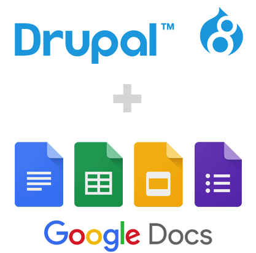

# Media Entity GoogleDocs
This module provides a GoogleDocs integration (i.e. media type
provider plugin) for Media entities.

/!\ Be aware of the different versions. As [Media Entity Module](https://www.drupal.org/project/media_entity) will be [merged into Drupal core in 8.4](https://www.drupal.org/node/2863992), it is important to download the appropriate version of the module.
- 8.x-1.x version is appropriate for any installation with Drupal core 8.3.x and lower. It depends on [Media Entity Module](https://www.drupal.org/project/media_entity) to work.
- 8.x-4.x version is appropriate for Drupal core 8.4.x and upper.

## Installation
[Check Setup Guide](_documentation/SETUP.md)

## Usage
[Check Usage Guide](_documentation/USAGE.md)

## Integration with Lightning Media
**Media Entity GoogleDocs** can be used with its companion module for Lightning Media. More information can be found at https://www.drupal.org/project/lightning_media_googledocs and https://github.com/dakkusingh/lightning_media_googledocs

## Contribute
Development is generally done via [GitHub pull requests](https://github.com/dakkusingh/media_entity_googledocs/pulls).
Every pull request should be linked to an [issue in drupal.org issue queue](https://www.drupal.org/project/issues/media_entity_googledocs) and vice-versa.

If you prefer usual patch-based workflow feel free to submit a patch. We started
using GitHub mostly for easier review process. However, there are no strong opinions
about that. Any contribution in any shape or form will be treated equally.
